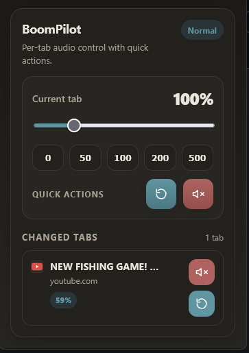

# BoomPilot

**Per-tab volume control for Firefox with live updates, quick presets, and a clean changed-tabs dashboard.**

BoomPilot is a Firefox extension built for people who want tighter control over audio on a tab-by-tab basis. It lets you mute, lower, normalize, or boost a tab instantly, while also keeping track of every tab you changed in one compact control panel.

## Preview

  

## Why BoomPilot?

Firefox gives you basic tab mute controls, but sometimes that is not enough. BoomPilot adds a faster workflow for everyday audio control, especially when you are juggling YouTube, music tabs, streams, or background sites at the same time.

## Features

- **Live volume updates** while dragging the slider.
- **Per-tab control** from 0% to 500%.
- **Quick presets** for 0, 50, 100, 200, and 500.
- **Quick actions** for mute and reset.
- **Changed tabs list** with site favicon, volume badge, and one-click actions.
- **Toolbar badge** that shows changed volume and stays hidden at 100%.
- **Active tab sync** so popup controls reflect the current tab state.

## How it works

BoomPilot injects a content script into pages and adjusts audio/video elements on supported sites. On pages that allow Web Audio processing, it uses gain control for boosting above normal volume; on simpler pages, it falls back to direct media element controls.

## Install locally

1. Download or clone this repository.
2. Open Firefox.
3. Go to `about:debugging`.
4. Click **This Firefox**.
5. Click **Load Temporary Add-on**.
6. Select `manifest.json` from the project folder.

## Usage

- Open the BoomPilot popup from the Firefox toolbar.
- Drag the slider for live adjustment.
- Use the preset buttons for fast jumps.
- Use the changed-tabs list to mute, reset, or jump to tabs you already modified.

## Notes

- Works best on sites using standard HTML5 audio or video.
- Some sites with DRM, heavily customized media pipelines, or other audio extensions may behave differently.
- Boosting very high values can introduce distortion depending on the source audio.
